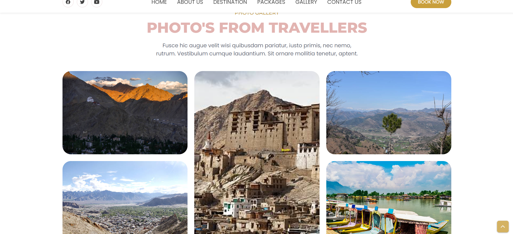
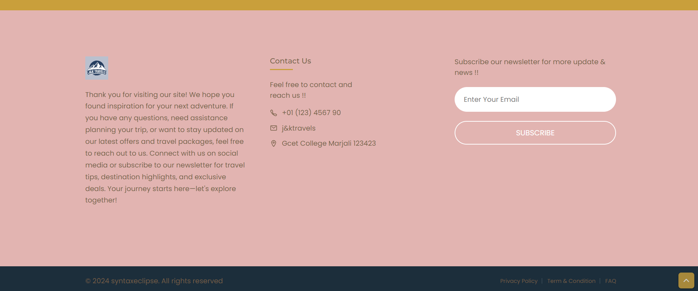
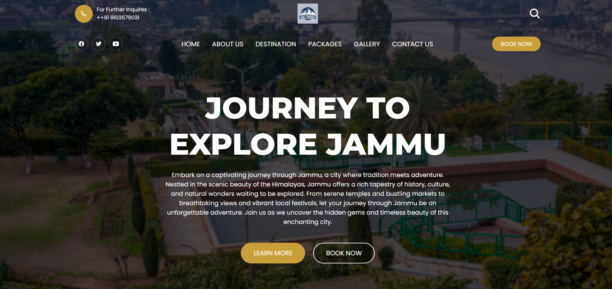

# J&K Travels Website

A travel website showcasing the beautiful destinations of Jammu and Kashmir, providing information about popular tourist spots, packages, and travel inquiries.

## Table of Contents
- [Introduction](#introduction)
- [Features](#features)
- [Technologies Used](#technologies-used)
- [Setup](#setup)
- [Usage](#usage)
- [Screenshots](#screenshots)
- [Contributing](#contributing)
- [License](#license)

## Introduction

This project is a front-end web application that helps users explore travel destinations in Jammu and Kashmir. The site provides information about different destinations, tour packages, and the ability to make travel inquiries.

## Features

- Responsive design for all screen sizes.
- Informative sections about popular travel destinations.
- Search and book tour packages.
- Contact form for inquiries.

## Technologies Used

- **HTML5**: Structure of the web pages.
- **CSS3**: Styling for the website.
- **JavaScript**: For interactive elements (if applicable).
- **Google Fonts**: For improved typography.
- **Ionicons**: For icons used throughout the site.

## Setup

To set up the project locally:

1. Clone the repository:
   ```bash
  [ gitlink](https://github.com/aamirmaqsood536/website-1
   ```
2. Navigate to the project directory:
   ```bash
   cd jk-travels
   ```
3. Open `index.html` in your browser to view the website.

## Usage

- Explore different destinations in Jammu and Kashmir.
- Use the form to search for travel packages or make an inquiry.
- Click on the "Book Now" button to get started.

## Screenshots

### Home Page


### Destination Section


### Booking Form



## Contributing

Contributions are welcome! Please open an issue or submit a pull request for any changes or improvements.
